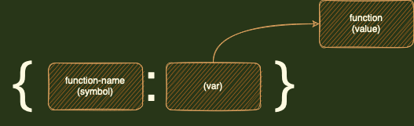
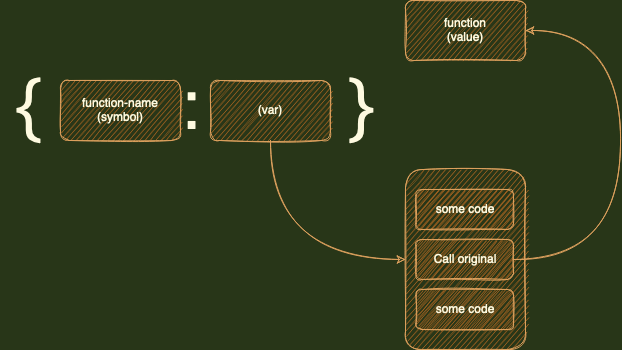

# inspector

[](https://clojars.org/org.clojars.akshay/inspector)

Inspector lets you see who is calling who (functions call hierarchy), with what arguments, what was retuned, execution time and so on.

# Table of Contents
- [Add dependency](#Add-dependency)
- [Features](#Features)
- [Basic Usage](#Basic-Usage)
  - [Setup](#Setup)
  - [Normal mode](#Normal-mode)
  - [Omnipresent mode](#Omnipresent-mode)
  - [Note](#Note)
- [Normal mode and output](#Normal-mode-and-output)
- [Normal mode and raw data](#Normal-mode-and-raw-data)
- [Omnipresent mode and repl](#Omnipresent-mode-and-repl)
- [Track specific fn/ns](#Track-specific-fnns)
- [:i-skip metadata](#i-skip-metadata)
- [Want something else?](#Want-something-else)
- [How inspector works?](#How-inspector-works)

## Add dependency
Leiningen
```clojure
[org.clojars.akshay/inspector "1.1.1-SNAPSHOT"]
```

Clojure CLI/deps.edn
```clojure
org.clojars.akshay/inspector {:mvn/version "1.1.1-SNAPSHOT"}
```

## Features
- Small api: `get-vars`, `iprint`, `ispit`, `stream-raw`.
- Granular control over which function gets tracked.
- Minimal performance overhead.
- Mode:
  - normal: get visually comprehensible output when a function gets called. `iprint`, `ispit`
  - omnipresent: capture data for all functions, across all threads, all the time. `stream-raw`
- For every function call you have access to:
  - `:fn-name` namespace qualified name.
  - `:fn-args` arguments.
  - `:fn-rv`   return value.
  - `:e`       error (returned only if an error occur).
  - `:time`    time duration (nanosecond) taken by function to execute.
  - `:id`      uniquely identifies each function call.
  - `:tid`     thread id.
  - `:c-id`    caller's id.
  - `:c-tid`   caller's thread id.
  - `:c-chain` vector of function `id`s which eventually lead to call to current fn.
  - `:uuid`    used for grouping all the function calls, which happens due to call to a single top level function.
    - Example: you get a call to endpoint /api/do_stuff, then all the functions that gets executed due to it will have the same uuid.

## Basic Usage

### Setup

```clojure
(require '[inspector.inspector :as i])
```

```clojure
"get-vars: returns a set of all function vars defined in namespaces (which matches given regex)"

; Generally you would want to track all functions that you have defined.
(def my-vars (i/get-vars #"your-code-base.*"))
```

### Normal mode
```clojure
"iprint, ispit: prints or spits, output of a function call (and all the functions that it call), in a visually comprehensible manner"

(i/iprint my-vars #(my-fn arg1 arg2 argn))

; or
(i/ispit "/tmp/hierarchy.log" my-vars #(my-fn arg1 arg2 argn))
```
Example output  from `inspector.test.inspector-test`
```
Time: Tue Jan 23 16:28:30 IST 2024
Г-- inspector.test.inspector-test/parallel (1) <-- arguments
|  Г-- inspector.test.inspector-test/simple (0)
|  |  Г-- inspector.test.inspector-test/simplest (0)
|  |  L-- 0
|  L-- 0
|  Г-- inspector.test.inspector-test/simple (1)
|  |  Г-- inspector.test.inspector-test/simplest (1)
|  |  L-- 1
|  L-- 1
L-- [0 1] <-- return value
```

### Omnipresent mode
```clojure
(defn export-fn 
  [{:keys [:fn-name :fn-args :fn-rv :e :time :id :tid :c-id :c-tid :c-chain :uuid]} :as record]
  ; log it, or send it to elasticsearch, or to redis to analyse later, ...
  (clojure.tools.logging/info (dissoc record :fn-args :fn-rv)))
  
; export-fn will be called every time a function execution completes
; place it somewhere in your -main function
(i/stream-raw my-vars export-fn)
```

### Note
Normal mode: 
- i.e. `iprint` and `ispit`
- use it when you are focused on a single function (and any functions it might call).

Omnipresent mode: 
- i.e. `stream-raw`
- use it when you want to collect data on execution of all the functions.
- when calling `stream-raw` using repl in any remote environment (staging/production), <br> make sure to restore the environment as mentioned in [using repl](#using-repl)

### Normal mode and output
`iprint` and `ispit` take optional `opts`. check `i/parse-opts` to see all possible options.
```clojure
; Default output of iprint looks like this
(i/iprint my-vars #(my-fn arg1 arg2))
; => output
Г-- fn-name fn-args
|  Г-- fn-name fn-args
|  |  Г-- fn-name fn-args
|  |  L-- fn-rv
|  L-- fn-rv
|  Г-- fn-name fn-args
|  L-- fn-rv
L-- fn-rv

; You can change it by providing opts
(i/iprint my-vars #(my-fn arg1 arg2) {:start [:id :fn-args]})
; => output
Г-- fn-name id fn-args
|  Г-- fn-name id fn-args
|  |  Г-- fn-name id fn-args
|  |  L-- fn-rv
|  L-- fn-rv
|  Г-- fn-name id fn-args
|  L-- fn-rv
L-- fn-rv

(i/iprint my-vars #(my-fn arg1 arg2) {:start [:id]
                                      :end [:time :fn-rv]})
; => output
Г-- fn-name id
|  Г-- fn-name id
|  |  Г-- fn-name id
|  |  L-- time fn-rv
|  L-- time fn-rv
|  Г-- fn-name id
|  L-- time fn-rv
L-- time fn-rv

(i/iprint my-vars #(my-fn arg1 arg2) {:start-only? true
                                      :start [:time :fn-rv]})
; => output
--> fn-name time fn-rv
   --> fn-name time fn-rv
      --> fn-name time fn-rv
   --> fn-name time fn-rv
```

## Normal mode and raw data
```clojure
; rv is return value of (my-fn arg1 arg2 argn)
(let [{:keys [e rv records]} (i/export-raw my-vars #(my-fn arg1 arg2 argn)] 
  records)
```

Example output from `inspector.test.capture-test`
```clojure
[{:c-chain [1 2] :id 4 :c-id 2   :fn-name "inspector.test.capture-test/simplest" :fn-args (0) :tid 30 :c-tid 30  :uuid #uuid "4c3bf13a-7899-4202-ade6-cfa0dfc3955e" :time 6584   :fn-rv 0}
 {:c-chain [1]   :id 2 :c-id 1   :fn-name "inspector.test.capture-test/simple"   :fn-args (0) :tid 30 :c-tid 34  :uuid #uuid "4c3bf13a-7899-4202-ade6-cfa0dfc3955e" :time 49583  :fn-rv 0}
 {:c-chain [1 3] :id 5 :c-id 3   :fn-name "inspector.test.capture-test/simplest" :fn-args (1) :tid 29 :c-tid 29  :uuid #uuid "4c3bf13a-7899-4202-ade6-cfa0dfc3955e" :time 1625   :fn-rv 1}
 {:c-chain [1]   :id 3 :c-id 1   :fn-name "inspector.test.capture-test/simple"   :fn-args (1) :tid 29 :c-tid 34  :uuid #uuid "4c3bf13a-7899-4202-ade6-cfa0dfc3955e" :time 42625  :fn-rv 1}
 {:c-chain []    :id 1 :c-id nil :fn-name "inspector.test.capture-test/parallel" :fn-args (1) :tid 34 :c-tid nil :uuid #uuid "4c3bf13a-7899-4202-ade6-cfa0dfc3955e" :time 431833 :fn-rv [0 1]}]

; :fn-rv -> return value. Always check :e when :fn-rv is nil
; :e     -> will only be present in case an error was raised. In this case :fn-rv will be set as nil.
; :id    -> a unique identifier for each function call.
;           if a function is called twice with exact same arguments the both calls will have different id's assigned to them.
; :c-id  -> is the id of the caller function. 
;           c-id = nil implies caller is unknown. 
;           Either because caller function is not modified (because it's not part of my-vars),
;           Or caller function's value is directly being called. Example in case of most handler fns.
; :c-chain -> vector of `:id`. {:id 5 :c-chain [1 2 3 4]} => that :if 5 was called by 4 and 4 was called 3 and so on.
```

## Omnipresent mode and repl
### Too much data?
Then track only the functions / namespaces that you care about. <br>
Check [usage](#Track-specific-fnns) of `get-vars` and [:i-skip metadata](#i-skip-metadata)

### using repl
If you are connecting via repl to remote environment and trying out `i/stream-raw`, then you 
should restore vars to original value once you have completed collecting data.
```clojure
(inspector.core/restore-original-value my-vars)
```

## Track specific fn/ns
You can pick and choose which function you want to track using `get-vars` <br>
`get-vars` returns a set of vars which will be modified. <br>
Add or remove vars from this set depending on weather you want to track them or not. <br>
This is true for both normal and omnipresent mode.

```clojure
; track all function defined in all namespaces whose string representation matches regex #"dummy.*"
(i/get-vars #"dummy.*")

; track functions only from ns dummy.c
(i/get-vars #"dummy.c")

; track all function except those defined in dummy.c namespace
(clojure.set/difference (i/get-vars #"dummy.*") (i/get-vars #"dummy.c"))

; track only one fn.
#{#'dummy.c/c-2}

; track all functions except function dummy.c/c-2
; also see :i-skip metadata section
(set/difference (i/get-vars #"dummy.*") #{#'dummy.c/c-2})
```

## :i-skip metadata
To skip modifying a function either remove its var from `my-vars` or add metadata `:i-skip`.
```clojure
(defn ^:i-skip foo
  [args]
  :body)
```

## Want something else?
Inspector allow you to run arbitrary code before execution and after execution of every function that is being tracked. <br>
TODO: add more details here.

## How inspector works?

In clojure a function's name is a `symbol`.
The `symbol` maps to a `var` which has a reference to `value`.
Think of `value` as the actual function which will run when you do `(function-name arg1 arg2)`.

<br>
<br>
The idea is to change the reference present in `var` to point to a `new value` (or new function).
This `new value` (or new function) will wrap the original `value` (or function) with additional code.

<br>
<br>
Inspector provides a structured way to modify a lot of `values`(functions) at once in this way.

## License

This program and the accompanying materials are made available under the
terms of the Eclipse Public License 2.0 which is available at
http://www.eclipse.org/legal/epl-2.0.

This Source Code may also be made available under the following Secondary
Licenses when the conditions for such availability set forth in the Eclipse
Public License, v. 2.0 are satisfied: GNU General Public License as published by
the Free Software Foundation, either version 2 of the License, or (at your
option) any later version, with the GNU Classpath Exception which is available
at https://www.gnu.org/software/classpath/license.html.
