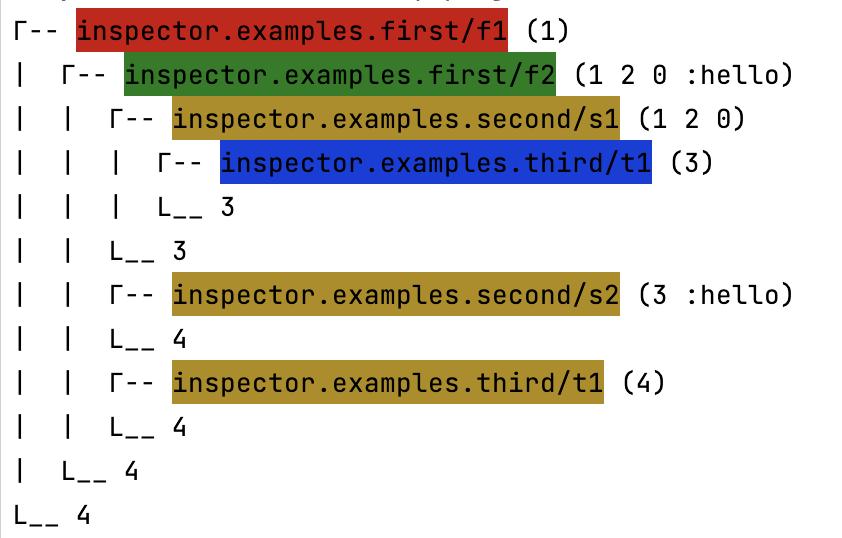
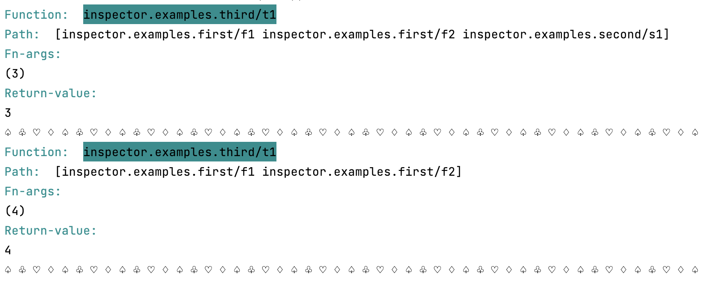

# inspector

[](https://clojars.org/org.clojars.akshay/inspector)

See what your functions are doing.

## Install
### Leiningen/Boot
```clojure
[org.clojars.akshay/inspector "0.4.0-SNAPSHOT"]
```

### Clojure CLI/deps.edn
```clojure
org.clojars.akshay/inspector {:mvn/version "0.4.0-SNAPSHOT"}
```

## Basic Usage

### Setup
```clojure
(require '[inspector.explore :as explore]
         '[inspector.fn-find :as fn-find]
         '[clojure.set :refer [difference]])

(def track-these-fns
   "Set of functions that you want to modify in some way."
   (difference
      ; Generally you would want to track all functions that you defined. Below line will do that. 
      (fn-find/get-vars #"your-code-base.*")
      ; Removing tests related functions
      (fn-find/get-vars #".*test.*")))
```

### Visualizing all function calls
```clojure
; Calling you functionally normally
(your-fn arg1 arg2 argn)

; visualizing all the function being called by `(my-fn arg1 arg2 argn)`
(explore/show-all-calls track-these-fns #(my-fn arg1 arg2 argn))

; Example
(def track-these-fns 
   ; Note here I am only tracking function that i defined in `inspector.examples.*` namespaces
   ; If your code base starts with abc.xxx... then you would do "xyz.*"
   (fn-find/get-vars #"inspector.examples.*"))

(explore/show-all-calls my-project-vars #(f1 1))
```


### Show calls to MongoDb
```clojure
; Calling you functionally normally
(your-fn arg1 arg2 argn)

; Calling you function to see if its performing any CRUD opertaions in mongodb
(explore/show-cross-group-calls {:my-proj  my-project-vars
                                 ; Track all functions defined in mongodb library
                                 :mongo (fn-find/get-vars #"mongodb.*")}
                                #(my-fn arg1 arg2 argn))

; example
; See calls happening to a particular namespace / group of vars
(def db-vars-group
   ; here for demo I am assuming that inspector.examples.third contains functions related to database
   (fn-find/get-vars #"inspector.examples.third"))

(def my-vars-group
   ; generally you won't need to take the difference.
   (clojure.set/difference (fn-find/get-vars #"inspector.examples.*") db-vars-group))

(explore/show-cross-group-calls {:my-proj my-vars-group :db my-vars-group} #(f1 1))
```


### Export data
```clojure
(explore/export "/tmp/data.json"
                my-project-vars
                #(my-fn arg1 arg2 argn))

; example
(def track-these-fns (fn-find/get-vars #"inspector.examples.*"))

(explore/export "/tmp/data.json" track-these-fns #(f1 1))
```
Output
```bash
$ tail -f /tmp/data.json
```

```json lines
{"fn_name":"inspector.examples.first/f1","fn_args":[1],"level":0,"fn_call_id":54,"t_name":"nREPL-session-dafe6f02-279f-44cf-ac79-11ba979b529e","t_id":20}
{"fn_name":"inspector.examples.first/f2","fn_args":[1,2,0,"hello"],"level":1,"fn_call_id":55,"t_name":"nREPL-session-dafe6f02-279f-44cf-ac79-11ba979b529e","t_id":20}
{"fn_name":"inspector.examples.second/s1","fn_args":[1,2,0],"level":2,"fn_call_id":56,"t_name":"nREPL-session-dafe6f02-279f-44cf-ac79-11ba979b529e","t_id":20}
{"fn_name":"inspector.examples.second/s1","fn_args":[1,2,0],"level":2,"fn_call_id":56,"t_name":"nREPL-session-dafe6f02-279f-44cf-ac79-11ba979b529e","t_id":20,"fn_return_value":3}
{"fn_name":"inspector.examples.second/s2","fn_args":[3,"hello"],"level":2,"fn_call_id":57,"t_name":"nREPL-session-dafe6f02-279f-44cf-ac79-11ba979b529e","t_id":20}
{"fn_name":"inspector.examples.second/s2","fn_args":[3,"hello"],"level":2,"fn_call_id":57,"t_name":"nREPL-session-dafe6f02-279f-44cf-ac79-11ba979b529e","t_id":20,"fn_return_value":4}
{"fn_name":"inspector.examples.first/f2","fn_args":[1,2,0,"hello"],"level":1,"fn_call_id":55,"t_name":"nREPL-session-dafe6f02-279f-44cf-ac79-11ba979b529e","t_id":20,"fn_return_value":4}
{"fn_name":"inspector.examples.first/f1","fn_args":[1],"level":0,"fn_call_id":54,"t_name":"nREPL-session-dafe6f02-279f-44cf-ac79-11ba979b529e","t_id":20,"fn_return_value":4}
```

## Idea

In clojure a function's name is a `symbol`.
The `symbol` maps to a `var` which has a reference to `value`.
Think of `value` as the actual function which will run when you do `(function-name arg1 arg2)`.

<br>
<br>
The idea is to change the reference present in `var` to point to a `new value` (or new function).
This `new value` (or new function) will wrap the original `value` (or function) with additional code.

<br>
<br>
Inspector provides a structured way to modify a lot of `value's`(functions) at once in this way.

## How it works ?
Inspector provides a structured way to modify a lot of functions at once.

### How does inspector modify a function - f
1. Runs `before rules`
   - A `rule` is some code which runs before/after `f`.
2. Calls the function `f` with its arguments, and captures it's `return value`.
3. Runs `after rules`
4. Returns the captured `return value`

## Concepts
### Template
Lays the structure that says:
1. run `before rules`
2. execute `original function` and capture its return value
3. run `after rules`
4. return `the captured return value of original function`

### Rule
A pair of functions called `condition` and `action`.
When `condition` evaluates to truthy value, `action` will be executed.

### Condition
A function which returns truthy or falsy value.
1. Arguments when `condition` is used in `before rules`
   - meta-data - original function's meta data.
   - fn-args   - arguments passed to the original function at runtime.
2. Arguments when `condition` is used in `after rules`
   - meta-data
   - fn-args
   - return-value - captured return value from the original function.

### Action
A function with side effects.
<br>
Same as `condition` in terms of arguments that it receives.


## General flow
1. Select functions to be modified - `inspector.fn_find`
2. Select a `template` that you want to apply on those functions.
3. Call `inspector.core/modify-fns` with the `template` and `selected functions`. It will return a function (say badass-function)
4. Pass your function to badass function


## Creating your own templates
Read
1. `inspector.templates.printer` (easy to understand)


## Files and Folders
- inspector.templates - some ready to use templates.
- inspector.core - core functions.
- inspector.fn_find - helper functions to find namespaces and function vars.
- inspector.explore - ready to use functions to start exploring you code.

## License

This program and the accompanying materials are made available under the
terms of the Eclipse Public License 2.0 which is available at
http://www.eclipse.org/legal/epl-2.0.

This Source Code may also be made available under the following Secondary
Licenses when the conditions for such availability set forth in the Eclipse
Public License, v. 2.0 are satisfied: GNU General Public License as published by
the Free Software Foundation, either version 2 of the License, or (at your
option) any later version, with the GNU Classpath Exception which is available
at https://www.gnu.org/software/classpath/license.html.
